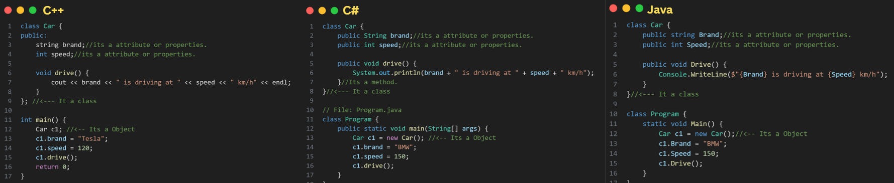
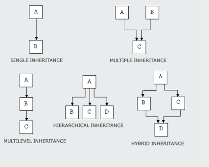
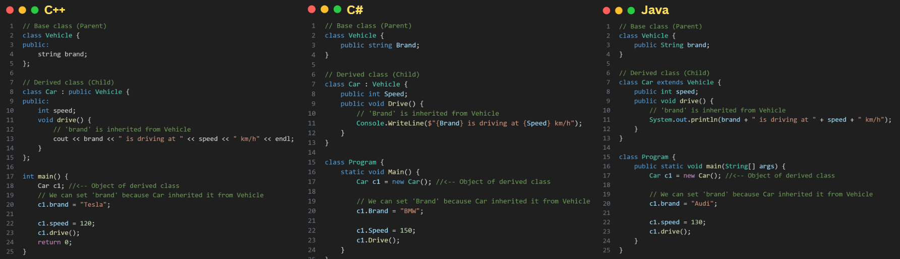
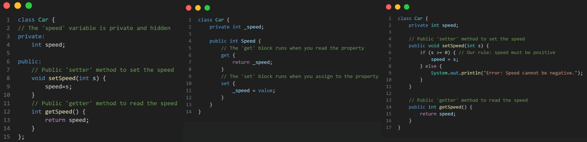

# Object-Oriented Programming (OOP) Concepts

This document explains the **core principles of Object-Oriented Programming (OOP)** — including **Class, Object, Inheritance, Encapsulation, Polymorphism,** and **Abstraction** — with examples in **C++**, **C#**, and **Java**.

### Why OOP?

OOPS is a programming paradigm used to **_organize_** code into **_reusable_**, **_modular_** components called "objects" to make software development and maintenance more **_efficient_**, **_scalable_**, and **_secure_**.

---

## 🧩 2. Class and Object

**Class**: A class serves as a blueprint or a template for creating objects. It defines the structure and behavior that objects of that class will possess.

**Object**: An object is an instance of a class. It is a concrete entity created based on the blueprint provided by a class.

### Examples

---
## 🧬 Inheritance:

It's a concept where a class inhert the properties or Methods of a parent class and Reuse it.

---
| Language | Single Inheritance | Multilevel Inheritance | Multiple Inheritance                                                                        |
| -------- | ------------------ | ---------------------- | ------------------------------------------------------------------------------------------- |
| C++      | ✅ Yes             | ✅ Yes                 | ✅ Yes (e.g., class C : public A, public B)                                                 |
| C#       | ✅ Yes             | ✅ Yes                 | ❌ No (A class can only inherit from one base class. It can implement multiple interfaces.) |
| Java     | ✅ Yes             | ✅ Yes                 | ❌ No (A class can only extend one base class. It can implements multiple interfaces.)      |

---
## 🔒 Encapsulation
---
Hide the Sensetive data from user.

**Access Modifiers:**
| Language | Access Modifiers | 
| -------- | ------------------ | 
| C++      | public, private, protected | 
| C#       | public, private, protected, internal |
| Java     | public, private, protected, default |

